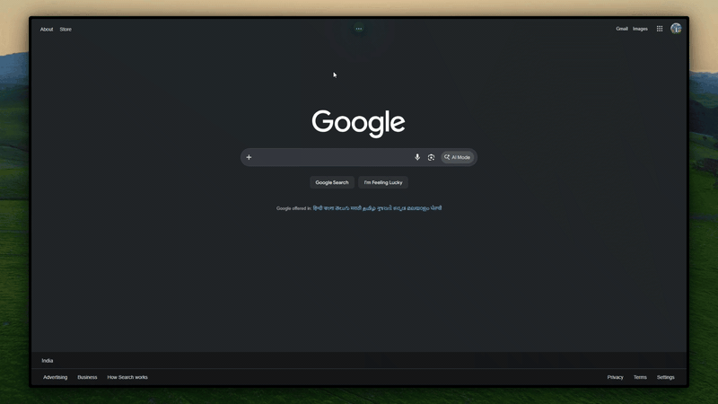

# Glance
*(Cross-Browser Extension)*

<p align="center">
  <a href="https://akshars07.github.io/glance/"></a>
</p>

<p align="center">
  <a href="https://microsoftedge.microsoft.com/addons/detail/glance/ihblpkbkbaeojengejgbnlcpfnaneegh"></a>
  &nbsp;&nbsp;
  <a href="https://addons.mozilla.org/en-US/firefox/addon/glance-for-web/"></a>
  &nbsp;&nbsp;
<a href="https://chromewebstore.google.com/detail/ijplknahhfcicfpgandihmonfgmkemnf">
  
</a>
</p>

<p align="center">
  <a href="https://ko-fi.com/aksharsrijan"></a>
</p>

A beautifully animated, Apple-style media controller that lives natively in your browser. Supports Spotify Web, Apple Music, YouTube, and YouTube Music with a 60FPS sync engine, Universal Picture-in-Picture teleportation, live time-synced lyrics, and a built-in Focus Mode with Pomodoro timer.

Works on Chrome, Edge, Firefox, Zen Browser, Brave, or any modern Chromium browser. Sits as a fixed overlay at the top of every webpage. Install in 30 seconds.

## In Action

### Lyrics Panel Teleport (v1.6)


### AMOLED Black Mode (v1.6)


---

## What's New in V1.7 (Focus Mode)

- **Pomodoro Timer**: Built-in Work, Short Break, and Long Break phases with configurable durations, launched from the popup.
- **Smart Site Blocker**: Blocking `google.com` also catches `google.co.in` and other regional variants, but never `music.youtube.com` when `youtube.com` is blocked.
- **Redesigned Blocked Page**: Full-screen countdown timer themed to your album art accent color, with a close tab button.
- **Bypass Once**: A 5-minute temporary pass that does not stop the active session. Hidden entirely in Strict Mode.
- **Already-Open Tab Catching**: Tabs open on blocked sites are redirected immediately when a session starts.
- **Study Mode Hint**: A one-time scroll hint in the music panel makes the Study Mode toggle discoverable.
- **Popup Accent Color**: The popup themes itself to the accent color of the currently playing song.

## What's New in V1.6.2 (The Polish Update)

- **Draggable Progress Bar**: Click and drag the dot on the progress bar to seek.
- **Shuffle & Repeat Support**: Native Shuffle and Repeat controls for Spotify, Apple Music, and YouTube Music.
- **Keyboard Shortcuts**: Global media key support (Play/Pause, Next, Previous) from any tab.
- **Quick Playlists**: Save up to 3 favorite playlists in the popup.
- **AMOLED Black Mode**: Pitch-black background mode for OLED screens.
- **Manual Lyrics Offset**: Customizable ±0.5s lyrics offset stepper in settings.
- **Ultra-Precise Sync Engine**: 400ms drift tolerance for a pixel-perfect 60FPS progress bar.

## What's New in V1.5

- **Apple Music Support**: Full support for `music.apple.com` via Apple's public MusicKit JS SDK.
- **Spotify Lyrics Sync Perfected**: Rewrote the lyrics tracking engine to correctly identify the primary audio element.

## What's New in V1.4

- **Spotify Web Integration**: Full support for `open.spotify.com` — track info, album art, and controls.
- **Micro-Stutter Latency Fix**: The island compensates for cross-process communication delays in the 60FPS engine.
- **Gapless Playback Fix**: Smoothly bridges YouTube Music's hidden gapless playback buffer gaps.

---

## Features

- **Media Playback Control:** Play, pause, skip, and scrub from the island. Double-click to jump to the media tab.
- **Time-Synced Lyrics & Romanization:** Animated lyrics with one-tap Romanization for Japanese, Korean, Chinese, and more. Click any line to seek.
- **Instrumental Progress Bar:** Smooth progress animation during instrumental breaks, synced to duration.
- **High-Res Artwork Fetching:** Cross-references tracks with the iTunes Search API for crisp album art.
- **Focus Mode:** Pomodoro timer with smart domain blocking. Blocks TLD variants without catching unrelated subdomains.
- **In-App Settings Panel:** Lyrics toggle, free placement, AMOLED mode, snap presets, and site blocklist.
- **Auto-Collapse & Idle State:** Expands on hover, collapses to a tiny dot when idle.
- **Cross-Tab PiP:** Briefly navigates to the media tab to trigger Picture-in-Picture and returns instantly.
- **Vibrant Theming:** Extracts the dominant color from album art and themes the entire island to match.

---

## Install

### From the Store (Recommended)
- **Google Chrome**: [Download from the Chrome Web Store](https://chromewebstore.google.com/detail/ijplknahhfcicfpgandihmonfgmkemnf)
- **Microsoft Edge**: [Edge Add-ons Store](https://microsoftedge.microsoft.com/addons/detail/glance/ihblpkbkbaeojengejgbnlcpfnaneegh)
- **Firefox / Zen Browser**: [Firefox Add-ons (AMO)](https://addons.mozilla.org/en-US/firefox/addon/glance-for-web/)

### Manual Installation (Developers / Brave)
1. Download the latest release zip from [Releases](https://github.com/AksharS07/glance/releases).
2. Extract the folder to a safe location.
3. Open `chrome://extensions` (or `edge://extensions`).
4. Enable **Developer Mode**.
5. Click **Load unpacked** and select the extracted folder.

No build step, no dependencies, no account required.

---

## How this was actually built

I am a 3rd-year CS/IoT/Cybersecurity engineering student. I do not enjoy frontend development. I did not write the HTML, CSS, or JS syntax for this project — that was handled by agentic AI (Google's Antigravity 2.0 and Claude).

What I did do: defined the product, made every architectural decision, and acted as QA throughout. I caught bugs the AI missed repeatedly — a silent `ReferenceError` killing color theming, a JavaScript closure bug binding every lyrics listener to the last line, an infinite loop in the Apple Music metadata fetcher, and Chromium's strict User Gesture requirement that forced a cross-tab navigation approach for PiP. The AI generated code; I decided what the code was supposed to do and whether it actually did it.

This is what AI-assisted development actually looks like in practice. It is a lot of iterative debugging and knowing when the output is wrong.

---

## Known Limitations

- **Platform Support:** Optimized for Apple Music, YouTube, YouTube Music, and Spotify Web. Native desktop apps cannot be supported due to browser sandbox rules.
- **Fake Visualizer:** The EQ bars animate randomly. No browser API exposes raw audio waveform data from an arbitrary tab to an external script.
- **Lyrics Availability:** Depends on lrclib.net and LyricsPlus databases. Mainstream tracks work well; obscure tracks often do not.
- **Chromium Throttling:** Background tab throttling can cause minor desyncs when skipping tracks.
- **Extension Restrictions:** Cannot appear on `chrome://` internal pages or the new tab page due to browser security policies.

---

## Development

```
src/
  core.js           # Shared: time formatting, color extraction, lyrics API
  styles.js         # CSS generation
  ui.js             # DOM creation and controller logic
  platform/
    chrome-ext.js   # Extension messaging and background logic
```

Run `node build.js` to regenerate output files and release `.zip` archives. No bundler required.

---

## Contributions

Pull requests are welcome. CSS edits belong in `src/styles.js`, core logic in `src/core.js`, and browser-specific code in `src/platform/`.
